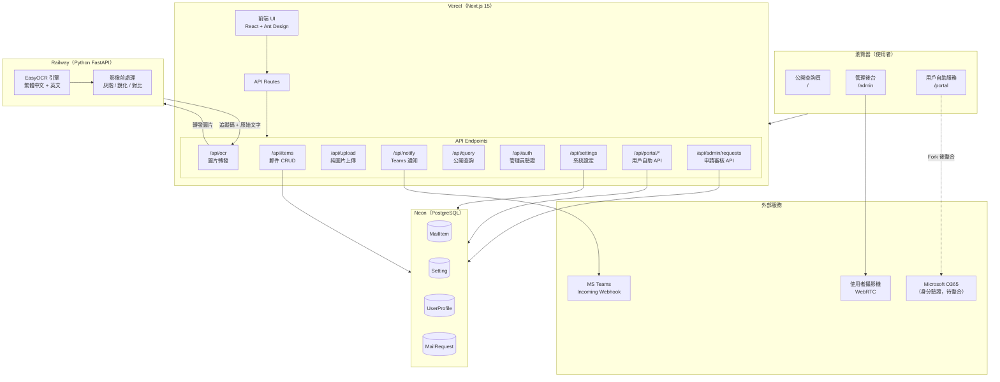
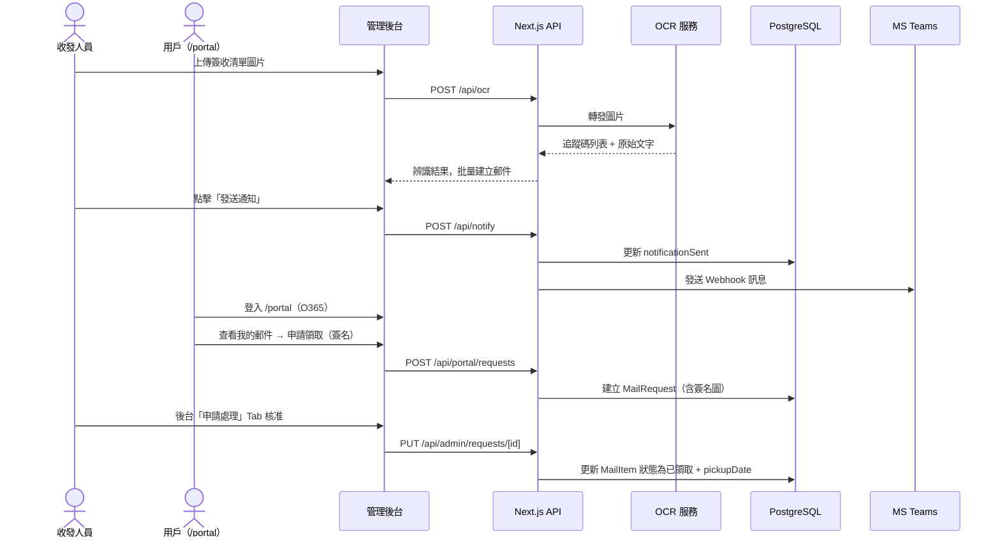

# 郵件收發流程系統 v1.1

淡江大學收發室專用的郵件管理系統，支援 OCR 批量建檔、攝影機拍照存檔、MS Teams 通知、逾期追蹤，以及用戶自助服務入口（含手寫簽名、線上申請）。

---

## 系統架構



---

## 資料流程



---

## 技術棧

| 層次 | 技術 | 說明 |
|------|------|------|
| **前端** | Next.js 15 + React 19 | App Router，`'use client'` 頁面 |
| **UI 元件** | Ant Design v5 | 表格、Modal、表單、Drawer |
| **資料庫 ORM** | Prisma v5 | Schema-first，型別安全查詢 |
| **資料庫** | PostgreSQL（Neon） | 雲端 Serverless PostgreSQL |
| **OCR** | Python FastAPI + EasyOCR | 繁體中文 + 英文辨識 |
| **通知** | MS Teams Incoming Webhook | MessageCard 格式推送 |
| **手寫簽名** | HTML5 Canvas（自製） | 支援滑鼠與觸控 |
| **身分驗證（待）** | Microsoft MSAL（O365） | Fork 後替換 `portal-auth.ts` |
| **部署** | Vercel + Railway | 自動 CI/CD，HTTPS |

---

## 功能清單

### 公開查詢頁（`/`）
- 輸入追蹤碼（6-8 碼數字）查詢郵件狀態
- 只顯示：**待領取（不限時）** + **已領取 / 已退回（三個月以內）**
- 顯示到件日期、領取期限、逾期警告、領取 / 退回日期時間

### 用戶自助服務（`/portal`）
> 需以 O365 帳號登入（目前為模擬登入，fork 後替換）

**功能一：基本資料設定**
- 姓名、學號 / 員工編號
- 目前在校狀態（在學中 / 已畢業 / 休學中 / 在職中 / 已離退）
- 預設領取方式
- 通知 Email（留空預設同 O365 帳號）
- 備注（給收發室的補充說明，如長期請假、轉寄地址等）

**功能二：我的郵件**
- 列出三個月以內郵件（待領取全部 + 已完成最近 50 筆）
- 顯示每筆郵件的申請狀態（申請中 / 已核准 / 已拒絕）
- 操作按鈕（狀態為「待領取」時顯示）：

| 操作 | 說明 |
|------|------|
| **領取（簽名）** | 開啟手寫簽名白板，簽名後送出申請 |
| **申請拒收** | 申請退回給寄件人 |
| **異動領取方式** | 申請更改預設領取方式 |
| **分送有誤** | 填寫正確收件人姓名 / Email 申請更正 |

### 管理後台（`/admin`）

**郵件清單 Tab**（原有功能）
- 密碼驗證登入，session 保留
- 新增郵件：手動輸入 / OCR 批量 / Webcam 拍照
- 篩選、搜尋、批量操作（通知、已領取、已退回、刪除）
- 逾期標色（紅底 / 黃底預警）
- 詳細 Drawer：附件圖片預覽、OCR 文字、領取 / 退回日期時間
- 確認領取：可選擇日期**時間**；確認退回：自動記錄退回時間

**申請處理 Tab**（新增）
- 顯示所有用戶送出的申請，待處理數量以 Badge 標示
- 支援核准 / 拒絕，可附管理員備注
- 核准時自動執行對應動作：

| 申請類型 | 核准效果 |
|----------|---------|
| 申請拒收 | `status → 已退回`，記錄 `returnDate` |
| 異動領取方式 | 更新 `pickupMethod` |
| 更正收件人 | 更新 `recipientName` / `recipientEmail` |
| 領取（簽名） | `status → 已領取`，記錄 `pickupDate`，可預覽手寫簽名圖 |

---

## O365 身分驗證整合（Fork 說明）

認證模組位於 `src/lib/portal-auth.ts`，目前使用 sessionStorage 模擬。  
Fork 後替換步驟：

```bash
npm install @azure/msal-react @azure/msal-browser
```

1. 在 `app/layout.tsx` 包裝 `MsalProvider`
2. 將 `portal-auth.ts` 中的 `login()` / `logout()` 替換為 MSAL 的 `loginPopup()` / `logoutPopup()`
3. 從 `useAccount()` 讀取 `email`（`account.username`）與 `displayName`（`account.name`）

詳細替換說明見 `src/lib/portal-auth.ts` 頂部注解。

---

## 目錄結構

```
mailchecklist/
├── nextjs-app/
│   ├── prisma/
│   │   └── schema.prisma           # MailItem / UserProfile / MailRequest / Setting
│   └── src/
│       ├── app/
│       │   ├── page.tsx            # 公開查詢頁（3個月篩選）
│       │   ├── portal/
│       │   │   └── page.tsx        # 用戶自助服務
│       │   ├── admin/
│       │   │   └── page.tsx        # 管理後台（郵件清單 + 申請處理）
│       │   └── api/
│       │       ├── items/          # 郵件 CRUD
│       │       │   └── [id]/
│       │       ├── portal/
│       │       │   ├── profile/    # 用戶基本資料 GET/POST
│       │       │   ├── mails/      # 用戶郵件查詢
│       │       │   └── requests/   # 用戶送出申請
│       │       ├── admin/
│       │       │   └── requests/   # 後台審核申請
│       │       │       └── [id]/
│       │       ├── ocr/            # OCR 轉發
│       │       ├── upload/         # 圖片上傳
│       │       ├── query/          # 公開查詢
│       │       ├── notify/         # Teams 通知
│       │       ├── auth/           # 管理員驗證
│       │       └── settings/       # 系統設定
│       ├── components/
│       │   ├── MailTable.tsx       # 郵件列表
│       │   ├── MailRequestModal.tsx # 用戶申請 Modal（含簽名）
│       │   ├── SignaturePad.tsx    # HTML5 Canvas 手寫簽名
│       │   ├── RequestsPanel.tsx   # 後台申請審核列表
│       │   ├── AddMailModal.tsx
│       │   ├── EditMailModal.tsx
│       │   ├── PickupModal.tsx
│       │   ├── ConfirmActionModal.tsx
│       │   └── StatusBadge.tsx
│       └── lib/
│           ├── db.ts               # Prisma Client 單例
│           ├── types.ts            # TypeScript 型別
│           └── portal-auth.ts      # O365 Auth 預留模組
└── ocr-service/                    # Python FastAPI OCR 微服務
    ├── main.py
    └── requirements.txt
```

---

## 資料庫 Schema

```prisma
model MailItem {
  id               Int        @id @default(autoincrement())
  trackingCode     String                          // 追蹤碼（6-8碼）
  mailType         String     @default("掛號")     // 普通/掛號/公文/包裹
  receivedDate     DateTime   @default(now())
  photoPath        String?
  listImagePath    String?
  ocrRawText       String?
  photoOcrText     String?
  recipientName    String?
  recipientEmail   String?
  notificationSent Boolean    @default(false)
  notificationDate DateTime?
  deadlineDays     Int        @default(7)
  pickupMethod     String?
  pickupPerson     String?
  pickupDate       DateTime?                       // 領取日期時間
  returnDate       DateTime?                       // 退回日期時間
  status           String     @default("待領取")   // 待領取/已領取/已退回
  notes            String?
  requests         MailRequest[]
  createdAt        DateTime   @default(now())
  updatedAt        DateTime   @updatedAt
}

model UserProfile {
  id            Int      @id @default(autoincrement())
  email         String   @unique               // O365 帳號
  name          String?
  studentId     String?
  defaultPickup String?
  notifyEmail   String?
  schoolStatus  String?                        // 在學中/已畢業/休學中/在職中/已離退
  notes         String?
  createdAt     DateTime @default(now())
  updatedAt     DateTime @updatedAt
}

model MailRequest {
  id          Int      @id @default(autoincrement())
  mailItemId  Int
  mailItem    MailItem @relation(...)
  userEmail   String
  type        String   // reject_return | change_pickup | wrong_recipient | pickup_signed
  requestData String?  // JSON（簽名圖 base64、新方式、正確收件人等）
  status      String   @default("待處理")       // 待處理/已核准/已拒絕
  adminNote   String?
  createdAt   DateTime @default(now())
  updatedAt   DateTime @updatedAt
}
```

---

## API 端點

### 公開

| 方法 | 路徑 | 說明 |
|------|------|------|
| `GET` | `/api/query?code=` | 公開查詢（待領取 + 三個月內已完成） |

### 管理後台

| 方法 | 路徑 | 說明 |
|------|------|------|
| `GET` | `/api/items` | 郵件列表 |
| `POST` | `/api/items` | 新增郵件 |
| `GET` | `/api/items/[id]` | 單筆郵件 |
| `PUT` | `/api/items/[id]` | 更新郵件（含 returnDate 自動記錄） |
| `DELETE` | `/api/items/[id]` | 刪除郵件 |
| `POST` | `/api/notify` | 發送 Teams 通知 |
| `POST` | `/api/ocr` | OCR 辨識 |
| `POST` | `/api/upload` | 圖片上傳 |
| `POST` | `/api/auth` | 管理員密碼驗證 |
| `GET/POST` | `/api/settings` | 系統設定 |
| `GET` | `/api/admin/requests` | 列出所有申請 |
| `PUT` | `/api/admin/requests/[id]` | 核准 / 拒絕申請 |

### 用戶 Portal

| 方法 | 路徑 | 說明 |
|------|------|------|
| `GET` | `/api/portal/profile?email=` | 讀取基本資料 |
| `POST` | `/api/portal/profile` | 建立 / 更新基本資料 |
| `GET` | `/api/portal/mails?email=` | 個人郵件清單（3個月/50筆） |
| `POST` | `/api/portal/requests` | 送出申請 |

---

## 本地開發

### 前置需求
- Node.js 18+
- Python 3.11+（OCR 服務選填）
- [Neon](https://neon.tech) 帳號（免費）

### 1. 複製環境變數

```bash
cd nextjs-app
cp .env.local.example .env.local
# 填入 DATABASE_URL（Neon）、ADMIN_PASSWORD
```

### 2. 安裝並初始化資料庫

```bash
npm install
npx prisma db push
```

### 3. 啟動 Next.js

```bash
npm run dev
# 公開查詢：http://localhost:3000
# 用戶入口：http://localhost:3000/portal
# 管理後台：http://localhost:3000/admin
```

### 4. 啟動 OCR 服務（選填）

```bash
cd ../ocr-service
python -m venv venv
venv\Scripts\activate        # Windows
pip install -r requirements.txt
python main.py               # http://localhost:8000
```

---

## 部署指南

### Vercel 環境變數

| 變數 | 說明 |
|------|------|
| `DATABASE_URL` | Neon Connection String |
| `ADMIN_PASSWORD` | 管理員密碼 |
| `OCR_SERVICE_URL` | Railway OCR 服務 URL（選填） |
| `TEAMS_WEBHOOK_URL` | Teams Webhook URL（選填） |

> Root Directory 設為 `nextjs-app`，其餘設定 Vercel 自動偵測。

### OCR 服務（Railway，選填）

1. Railway → New Project → Deploy from GitHub，Root Directory 設 `ocr-service`
2. 自動偵測 Python 並部署
3. 複製 URL 填入 Vercel 的 `OCR_SERVICE_URL`

---

## 注意事項

- **攝影機功能** 需 HTTPS（Vercel 預設提供）
- **圖片上傳** 在 Vercel 為暫時儲存（重新部署後清空），生產環境建議串接 Vercel Blob 或 S3
- **簽名圖** 以 base64 儲存於 `MailRequest.requestData`，大量使用時建議改為檔案儲存
- **O365 登入** 目前為模擬，正式上線前請依 `src/lib/portal-auth.ts` 說明完成 MSAL 整合
- Neon 免費方案儲存上限 **0.5 GB**

---

## License

MIT
