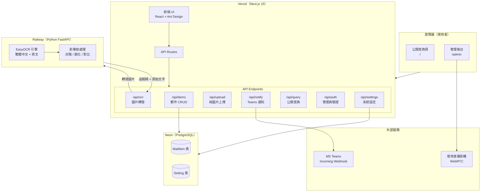
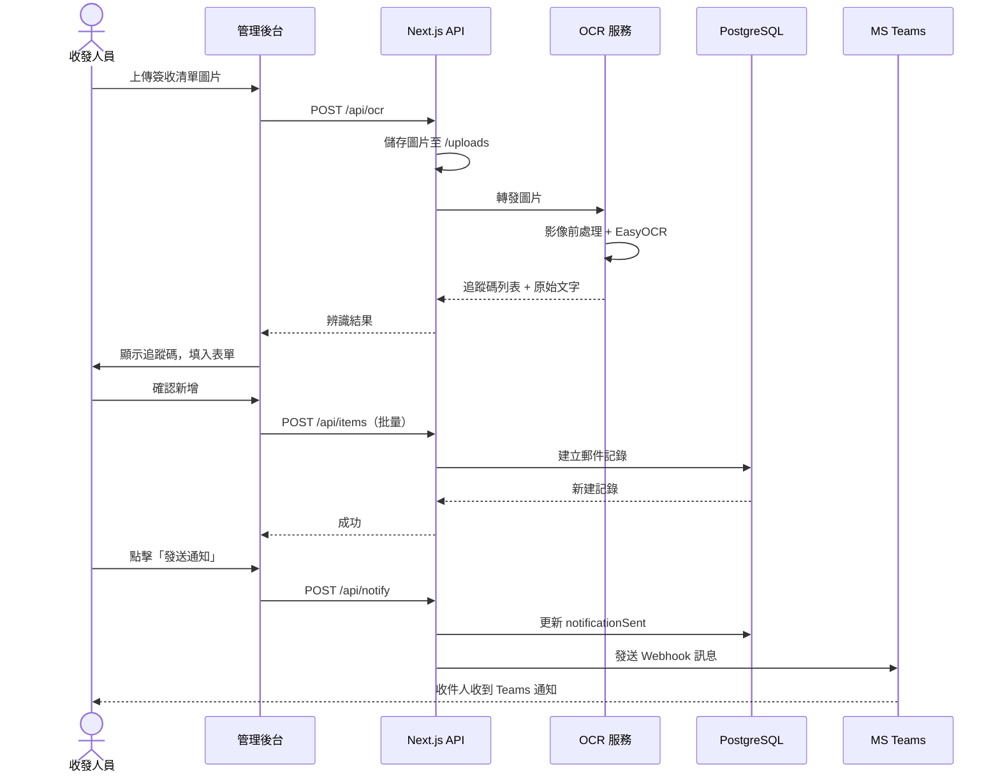

# 郵件收發流程系統 v1.0

淡江大學收發室專用的郵件管理系統，支援 OCR 批量建檔、攝影機拍照存檔、MS Teams 通知與逾期追蹤。

---

## 系統架構



---

## 資料流程



---

## 技術棧

| 層次 | 技術 | 說明 |
|------|------|------|
| **前端** | Next.js 15 + React 19 | App Router，`'use client'` 頁面 |
| **UI 元件** | Ant Design v5 | 表格、Modal、表單、Drawer |
| **資料庫 ORM** | Prisma v5 | Schema-first，型別安全查詢 |
| **資料庫** | PostgreSQL（Neon） | 雲端 Serverless PostgreSQL |
| **OCR** | Python FastAPI + EasyOCR | 繁體中文 + 英文辨識 |
| **通知** | MS Teams Incoming Webhook | MessageCard 格式推送 |
| **部署** | Vercel + Railway | 自動 CI/CD，HTTPS |
| **攝影機** | react-webcam | WebRTC，需 HTTPS |

---

## 功能清單

### 公開查詢頁（`/`）
- 輸入追蹤碼（6-8 碼數字）查詢郵件狀態
- 顯示到件日期、領取期限、逾期警告

### 管理後台（`/admin`）
- 密碼驗證登入（session 保留）
- **新增郵件** — 三種方式：
  - 手動輸入追蹤碼
  - 上傳簽收清單圖片（OCR 批量辨識）
  - Webcam 拍攝貨物照片
- **郵件列表** — 篩選、搜尋、排序
  - 逾期標色（紅底 / 黃底預警）
  - 批量操作（通知、已領取、已退回、刪除）
- **編輯郵件** — 可更換貨物照片
- **詳細查看** — Drawer 顯示所有欄位 + 附件圖片預覽 + OCR 原始文字
- **發送 Teams 通知** — 單筆或批量
- **系統設定** — 預設領取期限天數

---

## 目錄結構

```
mailchecklist/
├── nextjs-app/                  # Next.js 主體
│   ├── prisma/
│   │   └── schema.prisma        # 資料庫 Schema
│   ├── public/
│   │   └── uploads/             # 上傳圖片存放位置
│   └── src/
│       ├── app/
│       │   ├── page.tsx         # 公開查詢頁
│       │   ├── admin/
│       │   │   └── page.tsx     # 管理後台
│       │   └── api/
│       │       ├── items/       # 郵件 CRUD
│       │       │   └── [id]/    # 單筆操作
│       │       ├── ocr/         # OCR 轉發
│       │       ├── upload/      # 純圖片上傳
│       │       ├── query/       # 公開查詢
│       │       ├── notify/      # Teams 通知
│       │       ├── auth/        # 管理員驗證
│       │       └── settings/    # 系統設定
│       ├── components/
│       │   ├── AddMailModal.tsx  # 新增郵件 Modal
│       │   ├── MailTable.tsx     # 郵件列表 + 編輯
│       │   ├── OcrUpload.tsx     # OCR 上傳元件
│       │   ├── WebcamCapture.tsx # 攝影機元件
│       │   └── StatusBadge.tsx  # 狀態標籤
│       └── lib/
│           ├── db.ts            # Prisma Client 單例
│           └── types.ts         # TypeScript 型別
└── ocr-service/                 # Python OCR 微服務
    ├── main.py                  # FastAPI 應用
    └── requirements.txt
```

---

## 本地開發

### 前置需求
- Node.js 18+
- Python 3.11+
- [Neon](https://neon.tech) 帳號（免費）

### 1. 複製環境變數

```bash
cd nextjs-app
cp .env.local.example .env.local
# 編輯 .env.local，填入 Neon 的 DATABASE_URL 與 ADMIN_PASSWORD
```

### 2. 安裝並初始化資料庫

```bash
npm install
npx prisma db push
```

### 3. 啟動 Next.js

```bash
npm run dev
# http://localhost:3000
```

### 4. 啟動 OCR 服務（選填）

```bash
cd ../ocr-service
python -m venv venv
venv\Scripts\activate        # Windows
# source venv/bin/activate   # Mac/Linux
pip install -r requirements.txt
python main.py
# http://localhost:8000
```

---

## 部署指南

### Step 1：推上 GitHub

```bash
# 在專案根目錄
git init
git add .
git commit -m "init: 郵件收發系統 v1.0"
# 在 GitHub 建立 Repo 後：
git remote add origin https://github.com/<your-username>/<repo>.git
git push -u origin main
```

### Step 2：建立 Neon 資料庫

1. 至 [neon.tech](https://neon.tech) 註冊免費帳號
2. 建立新專案（選最近的區域）
3. 複製 **Connection String**（格式：`postgresql://...`）

### Step 3：部署到 Vercel

1. 至 [vercel.com](https://vercel.com) 用 GitHub 帳號登入
2. Import 剛剛的 GitHub Repo
3. **Root Directory** 設為 `nextjs-app`
4. 在 **Environment Variables** 填入：

| 變數名稱 | 值 |
|---|---|
| `DATABASE_URL` | Neon 的 Connection String |
| `ADMIN_PASSWORD` | 自訂密碼 |
| `OCR_SERVICE_URL` | Railway OCR 服務 URL（Step 4 後填入） |
| `TEAMS_WEBHOOK_URL` | Teams Webhook URL（選填） |

5. 點擊 **Deploy**

### Step 4：部署 OCR 服務到 Railway（選填）

1. 至 [railway.app](https://railway.app) 登入
2. New Project → Deploy from GitHub Repo
3. 選擇同一個 Repo，**Root Directory** 設為 `ocr-service`
4. Railway 會自動偵測 Python 並部署
5. 複製 Railway 提供的 URL，填回 Vercel 的 `OCR_SERVICE_URL`

> 若不部署 OCR 服務，手動輸入與攝影機拍照功能仍可正常使用。

---

## 資料庫 Schema

```prisma
model MailItem {
  id               Int       @id @default(autoincrement())
  trackingCode     String                    // 追蹤碼（6-8碼）
  mailType         String    @default("掛號") // 普通/掛號/公文/包裹
  receivedDate     DateTime  @default(now())
  photoPath        String?                   // 貨物照片路徑
  listImagePath    String?                   // 簽收清單圖片路徑
  ocrRawText       String?                   // OCR 原始辨識文字
  recipientName    String?
  recipientEmail   String?
  notificationSent Boolean   @default(false)
  notificationDate DateTime?
  deadlineDays     Int       @default(7)
  pickupMethod     String?
  pickupPerson     String?
  pickupDate       DateTime?
  status           String    @default("待領取") // 待領取/已領取/已退回
  notes            String?
  createdAt        DateTime  @default(now())
  updatedAt        DateTime  @updatedAt
}
```

---

## API 端點

| 方法 | 路徑 | 說明 |
|------|------|------|
| `GET` | `/api/items` | 取得郵件列表（支援 status / mailType / search 篩選） |
| `POST` | `/api/items` | 新增郵件 |
| `GET` | `/api/items/[id]` | 取得單筆郵件 |
| `PUT` | `/api/items/[id]` | 更新郵件（狀態、欄位、照片） |
| `DELETE` | `/api/items/[id]` | 刪除郵件 |
| `GET` | `/api/query?code=` | 公開查詢（by 追蹤碼） |
| `POST` | `/api/ocr` | 上傳圖片並呼叫 OCR 服務 |
| `POST` | `/api/upload` | 純圖片上傳（不呼叫 OCR） |
| `POST` | `/api/notify` | 發送 Teams 通知 |
| `POST` | `/api/auth` | 管理員密碼驗證 |
| `GET` | `/api/settings` | 取得系統設定 |
| `POST` | `/api/settings` | 更新系統設定 |

---

## 注意事項

- **攝影機功能** 需要 HTTPS（Vercel 預設提供）
- **上傳圖片** 在 Vercel 部署時為暫時儲存（重新部署後清空）；如需持久化請串接 Vercel Blob 或 AWS S3
- **OCR 服務** 第一次啟動需下載 EasyOCR 模型（約 1-2 分鐘，~500MB）
- Neon 免費方案儲存上限 **0.5 GB**，足夠數萬筆記錄

---

## License

MIT
